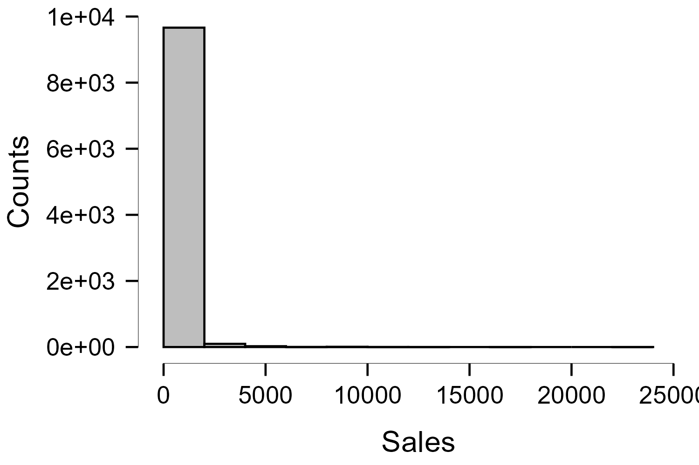
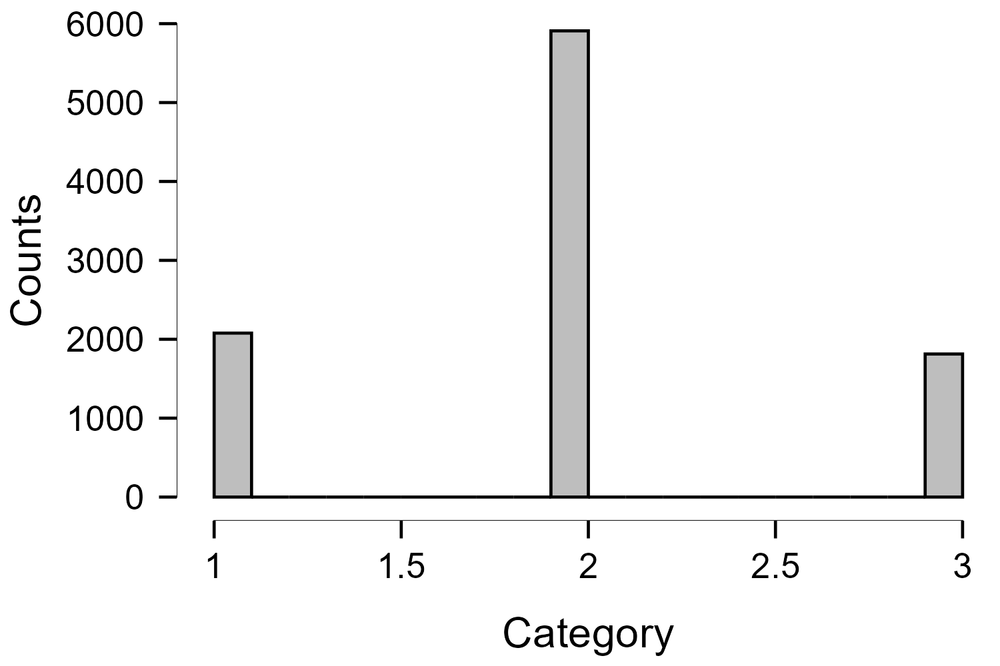
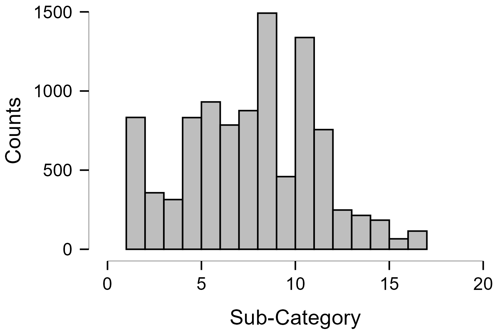
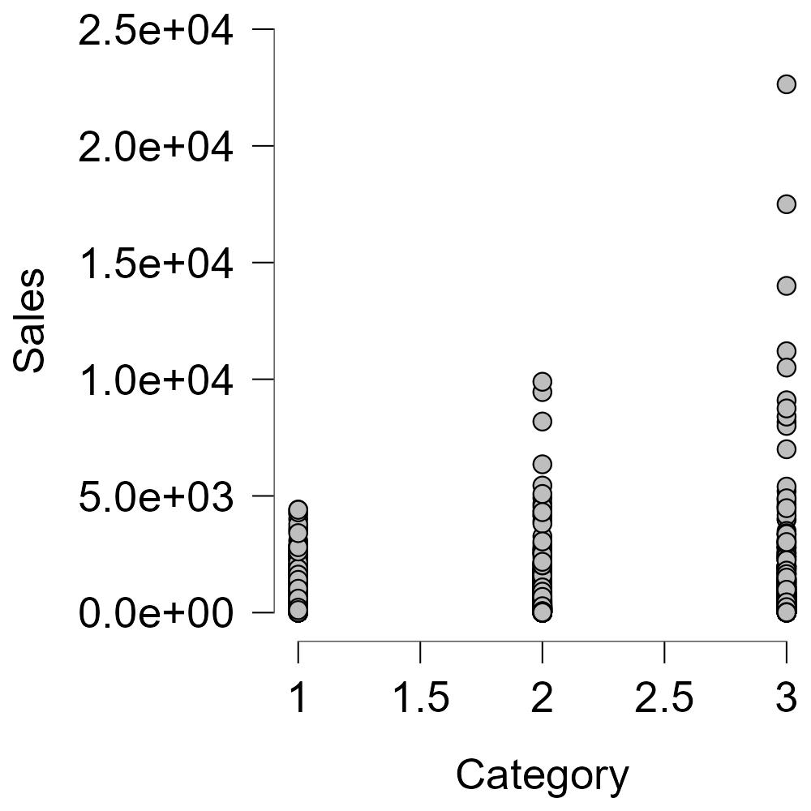
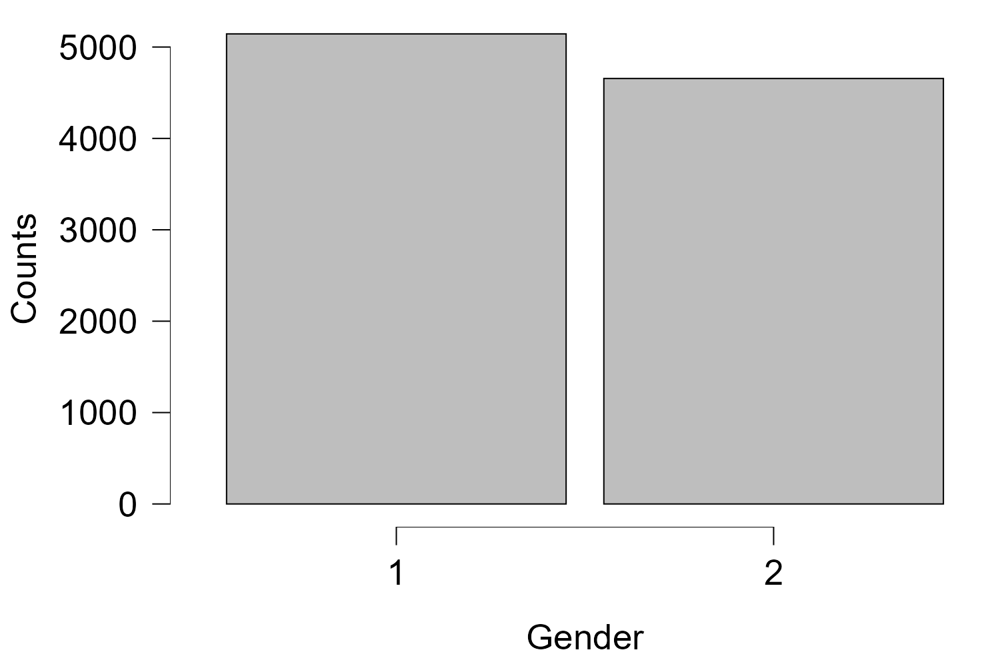
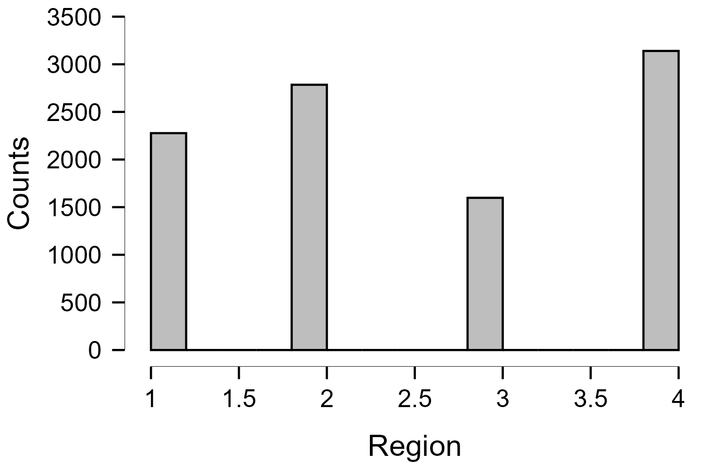
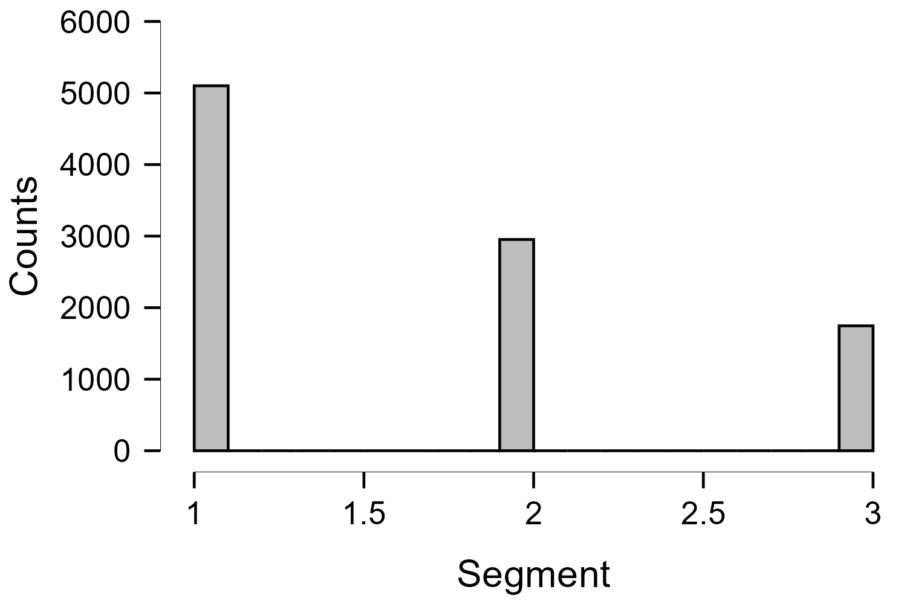
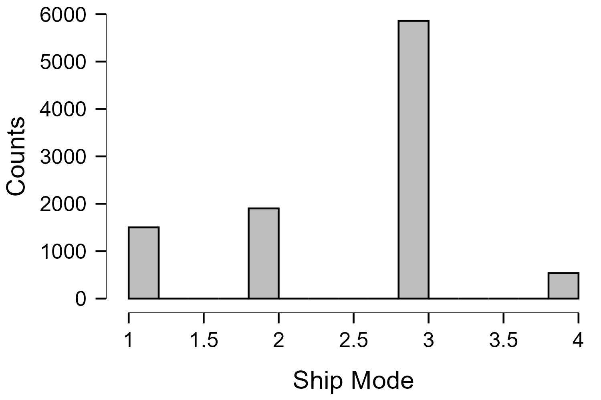
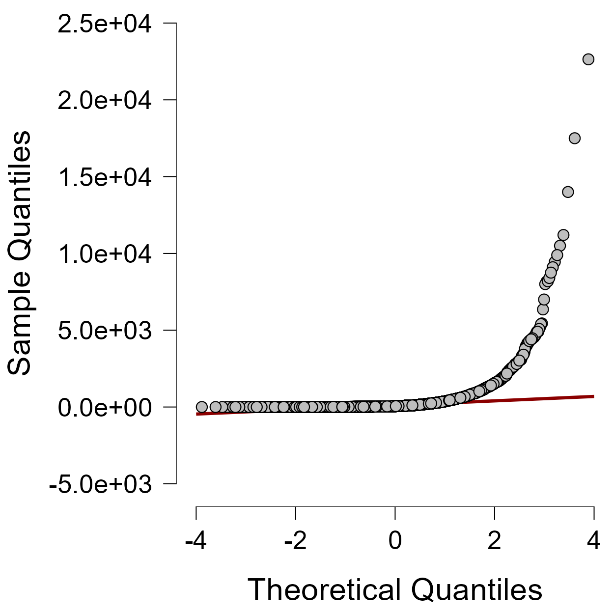

# Shopping Mall Sales

Statistical analysis of retail dataset of a global superstore for 4 years.

## Introduction

Dataset is of the shopping mall sales which consists of total 9800 rows.

For the dataset reference, [click here](https://www.kaggle.com/datasets/rohitsahoo/sales-forecasting)

In the dataset folder, the csv file is the original dataset and the xlsx file is the clean and manipulated dataset.

## Data Cleaning

Removed the product name column

Removed the order ID

Removed the product ID

Removed the customer ID

Removed the country also has only united states in mentioned

Removed the postal code 

Removed the shipping date column

Removed Customer name column

Removed city column

## Data Manipulation

Corrected “3 Carolina” into “Carolina”

Corrected “3 Dakota” into “Dakota”

Corrected “4 Virginia” into “Virginia”

Added a column gender

Converted string into integers for statistical analysis.

| Serial Number | Attribute     | Class      | Names                                                          |
|---------------|---------------|------------|----------------------------------------------------------------|
| 1             | Ship Mode     | 1, 2, 3, 4 | First Class; Second Class; Standard Class; Same Day            |
| 2             | Segment       | 1, 2, 3    | Consumer; Corporate; Home Office                               |
| 3             | Region        | 1, 2, 3, 4 | Central; East; South; West                                     |
| 4             | Category      | 1, 2, 3    | Furniture; Office Supplies; Technology                         |
| 5             | Sub Category  | 1–17       | Bookcases; Chairs; Labels; Tables; Storage; Furnishings; Art; Phones; Binders; Appliances; Paper; Accessories; Envelopes; Fasteners; Supplies; Copiers; Machines |
| 6             | Gender        | 1, 2       | Male; Female                                                   |

## Descriptive Analysis

How many people people bought the products at a certain price.

How many times a category was bought and in this case we can see than most of the time category 2 was bought which is <code>Office Supplies</code>

How many times a sub-category was bought and in this case sub-category 9 was bought most frequently that is <code>Binders</code>.

Maximum value of sales were received from category 3. This means category 3, which was <code>machines</code>, was most expensive.

More sales came from males than females.

Number of customers belonging to a specific region. We can see that most customers belong from region 4 that is <code>West</code>.

Number of customers belonging to a specific segment. We can see that most customers belong from segment 1 that is <code>Consumer</code>.

Number of customers who choosed a shipping mode. We can see that most customers choosed segment 3 that is <code>Standard Class</code>.

## Hypothesis Testing

Any attributes that influence sales attribute, we use those attributes including sales attribute for hypothesis testing.
First, we check if normal distribution is valid or nor.

The sales values are overlapping on the line. So, the sales data is normally distributed.

## T-Test on sales attribute

The sales data is quantitative and we don’t know the population standard deviation. So, we will conduct T-test.

*Independent Samples T-Test*

| Variable | t      | df   | p     |
|----------|--------|------|-------|
| Sales    | -0.442 | 9798 | 0.659 |

The p-value is greater than 0.05, so we reject alternative hypothesis and we can say there is no significance difference in sales data. This can also be seen in quartile graph.

#### Linear Regression Summary

*Model Summary – Sales*

| Model | R     |
|-------|-------|
| M₀    | 0.000 |
| M₁    | 0.041 |

*Note: M₁ includes Category*

*ANOVA – Sales*

| Source      | Sum of Squares | df   | Mean Square    | F       | p      |
|-------------|----------------|------|----------------|---------|--------|
| Regression  | 6.587×10⁶      | 1    | 6.587×10⁶      | 16.802  | < .001 |
| Residual    | 3.841×10⁹      | 9798 | 392060.331     |         |        |
| **Total**   | 3.848×10⁹      | 9799 |                |         |        |

*Note: M₁ includes Category*

*Coefficients – Sales*

| Model | Predictor   | Unstandardized B | Standard Error | Standardized β | t      | p      |
|-------|-------------|------------------|----------------|----------------|--------|--------|
| M₀    | Intercept   | 230.769          | 6.330          |                | 36.456 | < .001 |
| M₁    | Intercept   | 149.515          | 20.807         |                | 7.186  | < .001 |
|       | Category    | 41.184           | 10.047         | 0.041          | 4.099  | < .001 |

As the intercept values is < 0.001, we can say, yes, when product category is at its base level, we expect some fixed sales, and we’re confident this starting number is meaningful.

## Note

For descriptive analysis and hypothesis testing, JASP statistics software was used and as per my experience, it was very BAD.
